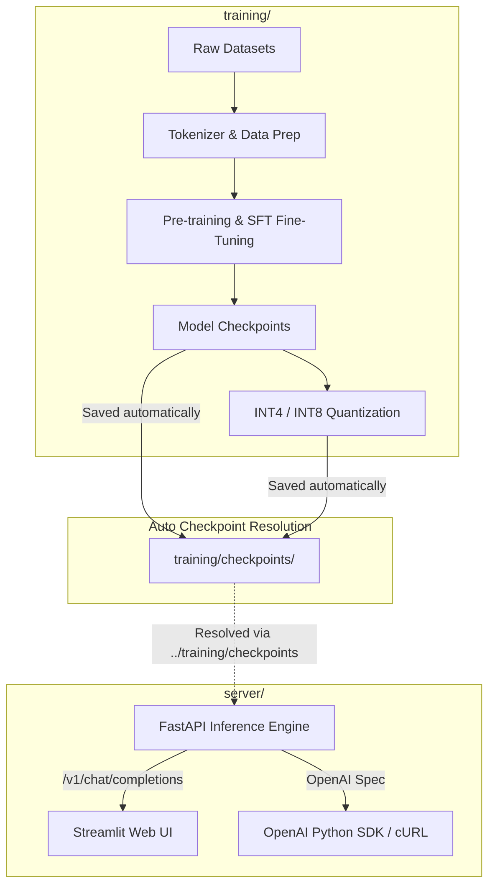

# Mini LLM: Custom Transformer Engine & OpenAI-Compatible Local API Server

An end-to-end, lightweight language model ecosystem designed with a clean, decoupled architecture. Train and fine-tune a lightweight LLM from scratch on PyTorch, compress it with post-training quantization, and serve it via an OpenAI-compatible FastAPI backend alongside a real-time Streamlit web interface.

---

## 🚀 System Architecture



The repository is built around **one core principle: zero-friction module independence**. 

* **`training/`**: Standalone training stack containing model definitions, dataset loaders, quantization tools, and CLI chat scripts.
* **`server/`**: Standalone inference stack managed via `uv`. It contains no training code or dataset dependencies—just enough to load checkpoints from `training/checkpoints/` and serve them.

---

## ✨ Key Features

* **Decoupled Workflows**: Clear separation of concerns between GPU training scripts and lightweight CPU/GPU inference serving.
* **OpenAI-Compatible API**: Implements standard `/v1/chat/completions`, `/v1/completions`, and `/v1/models` endpoints out of the box.
* **Dual Inference Modes**: Full support for real-time Server-Sent Events (SSE) token streaming (`stream: true`) and single-shot responses (`stream: false`).
* **Interactive Streamlit Web Explorer**: Built-in, responsive browser UI supporting live response streaming, toggleable generation modes, and status indicators.
* **Low-Bit Quantization (INT4 / INT8)**: Dynamic post-training quantization pipelines allowing full CPU-based execution with minimal memory footprints.
* **Modern Tooling (`uv`)**: Server environment uses `uv` for lightning-fast, reproducible virtual environment management.

---

## 🛠️ Tech Stack & Dependencies

| Component | Framework / Tool | Usage |
|---|---|---|
| **Core Architecture** | PyTorch 2.x | Model definition (RMSNorm, SwiGLU, RoPE), Training |
| **Tokenization** | HuggingFace `tokenizers` | Custom subword tokenizer implementation |
| **Backend Server** | FastAPI, Uvicorn, Pydantic | OpenAI-compatible REST API endpoints |
| **Frontend UI** | Streamlit, Requests | Interactive web workspace and API client |
| **Package Manager** | `uv` | Dependency resolution and environment execution |

---

## 📂 Directory Structure

```text
MiniLLM/
├── docs/                      ← Architectural docs & notes
│   ├── TRAINING.md            ← In-depth training & quantization docs
│   ├── SERVER.md              ← Detailed API server configurations
│   └── NOTES.md               ← Hardware requirements & limitations
│
├── training/                  ← Heavy GPU training folder
│   ├── checkpoints/           ← Model weights land here automatically
│   ├── prepare_data.py        ← Dataset preparation scripts
│   ├── pretrain.py            ← Raw text pre-training script
│   ├── train.py               ← Supervised instruction fine-tuning
│   ├── quantize.py            ← Post-training quantization tool
│   └── chat.py                ← Terminal-only direct model interaction
│
└── server/                    ← Standalone light server folder
    ├── app/
    │   ├── server.py          ← FastAPI application entry point
    │   ├── inference.py       ← Model loading & token generation logic
    │   ├── model.py           ← Copy of model architecture for inference
    │   └── quant_utils.py     ← Low-bit quantization loaders
    ├── streamlit_app.py       ← Interactive Streamlit web interface
    ├── pyproject.toml         ← UV dependencies (FastAPI, Streamlit, etc.)
    └── uv.lock
```

---

## 💻 Quick Start Guide

### Step 1: Train, Fine-Tune & Quantize

Navigate into `training/` to prepare data and train your model. Training artifacts automatically save to `training/checkpoints/`.

```bash
cd training

# 1. Tokenize datasets
python prepare_pretrain_data.py
python prepare_data.py

# 2. Pre-train & SFT Fine-tune
python pretrain.py
python train.py

# 3. (Optional) Quantize model to 4-bit CPU checkpoint
python quantize.py --bits 4
```

---

### Step 2: Start the Local API Server

Move into `server/`. The server automatically inspects `../training/checkpoints`—no manual file copying required.

```bash
cd ../server

# Sync lightweight dependencies via uv
uv sync

# Start the API server on http://localhost:8000
uv run python -m app.server
```

#### Server Options & Flags:
* **Serve Quantized Model:** `uv run python -m app.server --quantized --bits 4`
* **Custom Port:** `uv run python -m app.server --port 9000`
* **Custom Checkpoint Path:** `uv run python -m app.server --checkpoint_dir ../training/checkpoints`

---

### Step 3: Launch the Streamlit Web Interface

In a **second terminal window** (inside `server/`):

```bash
cd server
uv run streamlit run streamlit_app.py
```

Open `http://localhost:8501` in your browser to start prompting your model with streaming or non-streaming responses.

---

## 🔌 Interacting via API

### cURL Example

```bash
curl http://localhost:8000/v1/chat/completions \
  -H "Content-Type: application/json" \
  -d '{
        "model": "mini-llm",
        "messages": [{"role": "user", "content": "Why is the sky blue?"}],
        "stream": false
      }'
```

### OpenAI Python SDK Example

```python
from openai import OpenAI

# Connect directly to your local FastAPI server
client = OpenAI(base_url="http://localhost:8000/v1", api_key="not-needed")

response = client.chat.completions.create(
    model="mini-llm",
    messages=[{"role": "user", "content": "Why is the sky blue?"}],
    stream=True,
)

for chunk in response:
    print(chunk.choices[0].delta.content or "", end="", flush=True)
```

---

## 📖 Extended Documentation

| Document | Description |
|---|---|
| **[TRAINING.md](docs/TRAINING.md)** | Full training guide: pre-training, fine-tuning, CLI chat, and quantization arguments. |
| **[SERVER.md](docs/SERVER.md)** | Complete API specifications, JSON schema examples, and deployment options. |
| **[NOTES.md](docs/NOTES.md)** | Hardware benchmarks, architectural decisions, and memory considerations. |

---

## ⚠️ Key Model Limitations

* **Single-Turn Context**: The fine-tuned model is optimized for single instruction-to-response generation. While `/v1/chat/completions` accepts full `messages` context arrays for software compatibility, generation relies on the latest system prompt and user input.